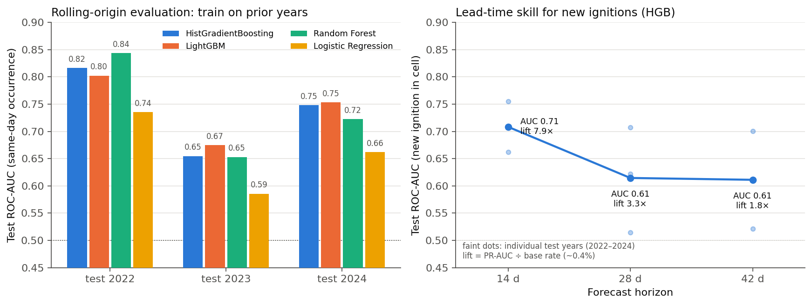

# Wildfire Early Warning from Vegetation Anomalies

Predicting same-day wildfire ignition in the Northern Sierra Nevada (California) from MODIS NDVI/EVI anomalies, gridMET weather, terrain, and land cover on a 500 m grid.

## Overview
I built this as a faculty-supervised independent research project at Boston University (June–November 2025). Each row is a grid cell on a fire-season day (Jun–Nov, 2018–2024); features are the most recent MODIS composite on or before that day, its 16/32/48-day lags, causal vegetation anomalies, and same-day weather. An early version joined the *nearest* composite in time, which could peek at a composite dated after the observation; `scripts/data_leak_patch.py` floors every composite date to the past, and `src/features/anomaly_leak.py` recomputes anomalies from past-only statistics.

## Results


Final table: **310,242 cell-days**, 148,290 cells, 55 features, ~34% positives (negatives sampled per fire day). Temporal split: train ≤2022, validate 2023, test 2024. Threshold chosen for max F1 on validation.

| Model (scikit-learn unless noted) | Test ROC-AUC | Test PR-AUC | Test F1 |
|---|---|---|---|
| HistGradientBoosting + isotonic calibration | **0.749** | 0.696 | 0.558 |
| HistGradientBoosting | 0.748 | 0.694 | 0.555 |
| XGBoost | 0.734 | 0.655 | 0.554 |
| LightGBM | 0.732 | 0.651 | 0.554 |
| Random Forest | 0.724 | 0.675 | 0.538 |
| Logistic Regression | 0.662 | 0.546 | 0.522 |

Vegetation lags evaluated: 2, 4, and 6 weeks (one, two, and three 16-day composites back). The primary label is same-day occurrence.

**Robustness.** Rolling-origin evaluation (test on 2022, 2023, 2024 in turn; `src/eval/robustness_eval.py`) gives HGB test ROC-AUC **0.74 ± 0.07** (0.82 / 0.66 / 0.75); 2023, a quiet fire season, is the weak year for every model. Holding out whole ~20 km spatial tiles (5-fold) scores 0.90 vs. 0.95 for random folds, so the model transfers to unseen locations and the harder generalization is across years, not space.

**Lead time.** Re-labelling each row as "new ignition in this cell within the next H days" (cells with no detection in the prior 30 days; `src/eval/lead_time_eval.py`) gives ROC-AUC 0.71 at 14 days, 0.61 at 28, 0.61 at 42, with PR-AUC 7.9× / 3.3× / 1.8× the base rate. New ignitions are rare in this sample (~0.4%, tens of positives per test year), so these are indicative, not precise. Rows exist only on days with fire activity somewhere in the region, so this measures where the next ignition is during an active period rather than whether one is coming.

## Data Sources
NASA FIRMS active-fire archive (MODIS C6.1, VIIRS S-NPP/NOAA-20/NOAA-21); MODIS MOD13A1 v6.1 NDVI/EVI 500 m 16-day composites with pixel-reliability QA (GeoTIFF); gridMET daily weather via `pygridmet` (tmmx, tmmn, pr, vpd, vs, rmin, rmax, srad); 30 m elevation and MODIS IGBP land cover sampled in Google Earth Engine.

## Method
- Grid: 500 m cells over a Northern Sierra rectangle (Susanville–Sonora–Chico–Lake Tahoe) with a 10 km buffer, EPSG:3310.
- Labels: FIRMS detections spatially joined to cells → positive cell-days; non-fire cells sampled on the same days as negatives.
- Composites: latest MODIS composite ≤ observation date (capped lookback, unmatched rows dropped); lags at −16/−32/−48 days.
- Anomalies: per-cell, per-calendar-month z-scores from an expanding past-only mean/std, clipped to ±5; deltas and slopes between current and lagged values.
- Temporal split by year (≤2022 / 2023 / 2024); max-F1 threshold on validation applied to test; isotonic calibration variant.

## Repo structure
```
scripts/   grid, FIRMS→labels helpers, negative sampling, gridMET fetch, MODIS GeoTIFF extraction, leak patch
src/features/  composite join, lags, causal anomalies, elevation/land-cover merge
src/models/model_benchmark.py  trains and evaluates all models, writes outputs/<run>/summary.csv
src/eval/   rolling-origin + spatial-block robustness checks; forward lead-time experiment; figure script
results/    CSV outputs behind the Robustness and Lead time numbers; figures/results.png
configs/config.yaml  documentary settings (not read by scripts)
```
`data/`, `cache/`, and `outputs/` are git-ignored.

## Quickstart
```bash
pip install -r requirements.txt
python scripts/northern_sierra_grid.py
python src/features/firms_to_labels.py          # needs data/interim/firms_all_filtered.parquet
python scripts/sample_nonfire.py
python scripts/fetch_gridmet.py                 # then copy weather_gridmet_features.parquet → data/processed/modeling_table.parquet
python scripts/extract_geotiff.py               # needs MOD13A1 NDVI/EVI GeoTIFFs in data/raw/modis
python src/features/ndvi_evi.py
python scripts/data_leak_patch.py --obs data/processed/modeling_table_with_veg.parquet \
  --veg data/interim/modis_data.parquet --lookback 16 --out data/processed/modeling_table_patched.parquet
python src/features/build_veg_features.py
python src/features/anomaly_leak.py
python src/models/model_benchmark.py --in data/processed/modeling_table_final2.parquet --outdir outputs/run1
```
Elevation and land cover are added with `scripts/gee_convert.py` → Google Earth Engine → `src/features/add_topo_landcover.py`. Paths inside the scripts are set at the top of each file.
